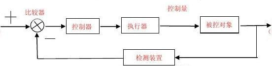

# BasicControlAlgorithms
My repo of basic control theory algorithms implementation.

- PID : A industrial faced control algorithm using P、I、D three parts of transfer function
  The implementation of PID is with full function about clamping method to solve the I term saturation problem & Low Pass Filter on the D term.
  My personal blog about [PID control](http://blog.sina.com.cn/s/blog_18411b89a0102ykkg.html)

- Kalman Filter 

  - Collecting information that cannot be directly detected
  - Cohering the information from mutiple sensor devices

  The implementation of KF is the ordinary Kalman Filter. Unscented Kalman Filter may be added later and the filter is used in some of my other projects.
  My personal blog about [Kalman Filter](http://blog.sina.com.cn/s/blog_18411b89a0102yks7.html)

- Fuzzy Logic Controller : A industrial faced controller using fuzzy logic instead of crisp logic
  This implementation of fuzzy logic controller is only 1-D and contains fuzzy logci function only the traingular function. It's easy to understand the insight.
  My personal blog about [Fuzzy Logic Controller](http://blog.sina.com.cn/s/blog_18411b89a0102yl16.html)

- To be continue

